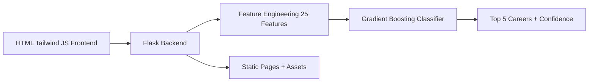

# CareerAI - AI Career Guidance System

[](https://career-ai-wefq.onrender.com/)


CareerAI is a full-stack machine learning web application that recommends top career paths from aptitude and performance inputs. It uses a trained Gradient Boosting classifier and serves both API and frontend pages from one Flask service.

Live URL: https://career-ai-wefq.onrender.com/

Repository: https://github.com/ManikantaPerla07/Career-ai

## Table of Contents

- [Overview](#overview)
- [Feature Highlights](#feature-highlights)
- [Resume Highlights](#resume-highlights)
- [Screenshots](#screenshots)
- [Tech Stack](#tech-stack)
- [Architecture](#architecture)
- [Architecture Diagram](#architecture-diagram)
- [How It Works](#how-it-works)
- [Project Structure](#project-structure)
- [API Reference](#api-reference)
- [Input Schema](#input-schema)
- [Run Locally](#run-locally)
- [Deploy on Render](#deploy-on-render)
- [Troubleshooting](#troubleshooting)
- [FAQ](#faq)
- [Contributing](#contributing)
- [Changelog](#changelog)
- [Roadmap](#roadmap)
- [Author](#author)
- [License](#license)

## Overview

CareerAI helps students and early professionals explore likely-fit career paths from structured assessment data. The model returns top-5 ranked recommendations with confidence scores, and the backend exposes clean endpoints for app integration.

## Feature Highlights

- End-to-end ML recommendation workflow.
- Top-5 career predictions with confidence percentages.
- 8 aptitude dimensions and 8 performance indicators.
- Feature-engineered input vector aligned with training schema.
- Flask backend serving both API and frontend static pages.
- Render-ready single-service deployment.

## Resume Highlights

- Built and deployed a production-style ML recommendation app using Flask and scikit-learn.
- Designed feature engineering pipeline with 25 model-aligned features for robust inference.
- Implemented ranked top-5 prediction endpoint with confidence scoring.
- Delivered one-service deployment architecture where backend serves both API and UI.
- Added operational docs for local run, deployment, and troubleshooting.

Resume-ready one-liner:

Developed and deployed a full-stack AI Career Guidance platform using Flask and Gradient Boosting to generate top-5 career recommendations with confidence scoring from aptitude and performance data.

## Screenshots

Add screenshots to:

- docs/screenshots/

Suggested file names:

- docs/screenshots/home.png
- docs/screenshots/features.png
- docs/screenshots/assessment.png
- docs/screenshots/results.png

Markdown snippet:

```md
### Home


### Features


### Assessment


### Results

```

## Tech Stack

Frontend

- HTML5
- Tailwind CSS
- JavaScript

Backend

- Python
- Flask
- Flask-CORS
- Gunicorn

Machine Learning

- scikit-learn
- NumPy
- pandas
- joblib

## Architecture

1. User submits aptitude and performance values from UI.
2. Flask API builds engineered feature vector.
3. Gradient Boosting model computes class probabilities.
4. API returns ranked top-5 careers with confidence.
5. Flask serves HTML pages and static assets from same service.

## Architecture Diagram



## How It Works

- Aptitude input: 8 numeric fields.
- Performance input: 8 categorical fields (POOR, AVG, BEST).
- Engineered features: aggregate score, diversity, intelligence/creativity/social/physical indices, performance score, high-performer flag, optional cluster.
- Inference output: sorted top-5 predictions from model probabilities.

## Project Structure

```text
Career-ai/
|- assets/
|  |- css/
|  |- js/
|- backend/
|  |- app.py
|  |- career_prediction_model.joblib
|  |- feature_order.json
|  |- feature_scaler.joblib
|  |- label_encoder.joblib
|  |- model_summary_report.txt
|  |- requirements.txt
|- index.html
|- about.html
|- features.html
|- test.html
|- contact.html
|- Procfile
|- render.yaml
|- requirements.txt
|- README.md
```

## API Reference

### GET /api

Returns API metadata and endpoint summary.

### GET /health

Returns service status, model-loaded state, and expected feature count.

Example response:

```json
{
  "status": "OK",
  "model_loaded": true,
  "features_expected": 25
}
```

### GET /careers

Returns all available career labels and total count.

### POST /predict

Returns top-5 ranked career predictions.

Request example:

```json
{
  "aptitudes": {
    "linguistic": 12,
    "musical": 10,
    "bodily": 11,
    "logical_mathematical": 15,
    "spatial_visualization": 14,
    "interpersonal": 13,
    "intrapersonal": 12,
    "naturalist": 11
  },
  "performance": {
    "project_performance": "AVG",
    "practical_skills": "AVG",
    "research_interest": "AVG",
    "communication_skills": "AVG",
    "leadership_qualities": "AVG",
    "teamwork": "AVG",
    "time_management": "AVG",
    "self_learning": "AVG"
  },
  "cluster": 0
}
```

Response example:

```json
{
  "status": "success",
  "top_predictions": [
    {
      "rank": 1,
      "career": "Economist",
      "confidence": 31.11
    }
  ]
}
```

## Input Schema

Aptitude keys:

- linguistic
- musical
- bodily
- logical_mathematical
- spatial_visualization
- interpersonal
- intrapersonal
- naturalist

Performance keys:

- project_performance
- practical_skills
- research_interest
- communication_skills
- leadership_qualities
- teamwork
- time_management
- self_learning

Accepted values for performance fields:

- POOR
- AVG
- BEST

## Run Locally

```bash
git clone https://github.com/ManikantaPerla07/Career-ai
cd Career-ai
python -m venv .venv
.venv\Scripts\activate
pip install -r requirements.txt
python backend/app.py
```

Open:

- http://127.0.0.1:5000

## Deploy on Render

This repository is configured for single-service deployment.

Render settings:

- Build command: pip install -r requirements.txt
- Start command: gunicorn backend.app:app
- Environment: Python
- File used: render.yaml

## Troubleshooting

If model fails to load:

- Confirm these files exist in backend/:
  - career_prediction_model.joblib
  - label_encoder.joblib
  - feature_order.json

If prediction returns feature mismatch:

- Ensure payload uses all required aptitude and performance keys.
- Confirm no custom code changed feature engineering order.

If static files do not load:

- Verify assets are in assets/ and URL path is /assets/<file>.
- Check that app is started from repository root context.

If Render build fails:

- Confirm requirements.txt includes backend dependencies via -r backend/requirements.txt.

## FAQ

### Why top predictions instead of one career?

The model outputs class probabilities. Returning top-5 improves usefulness and transparency.

### Is this suitable for final career decisions?

No. It is a guidance tool for educational use and should be combined with human mentoring.

### Why do confidence values not sum to 100 in response?

Only top-5 predictions are returned; not all classes are shown.

## Contributing

Contributions are welcome. Please read [CONTRIBUTING.md](CONTRIBUTING.md) before opening a pull request.

## Changelog

Release updates are tracked in [CHANGELOG.md](CHANGELOG.md).

## Roadmap

- Explainability output for model decisions.
- User login and recommendation history.
- Better analytics dashboard for trend insights.
- Enhanced mobile-first UI refinement.

## Author

Manikanta Perla

- Email: careerai.help@gmail.com

## License

This project is intended for educational and academic use.
